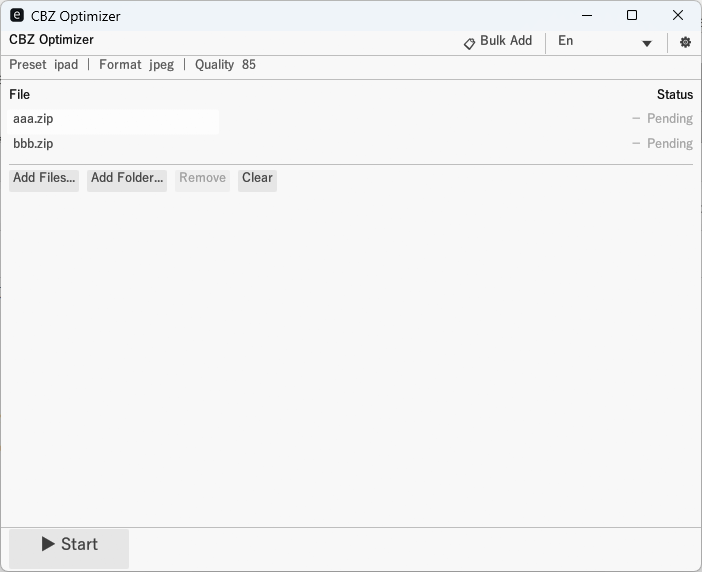
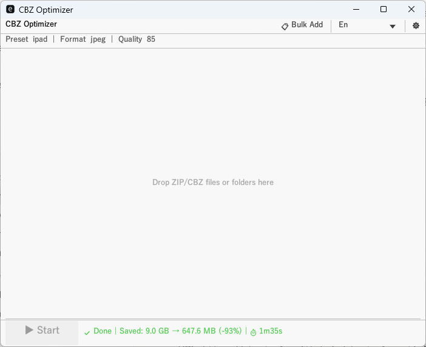

# cbz-tools-optimizer

Bulk-resize images inside ZIP/CBZ archives — significantly reduce file size with parallel processing.  
CLI for Windows / Linux / macOS. Windows GUI included.

[](LICENSE)

---

## Download

Download the latest release from [Releases](https://github.com/cbz-tools/cbz-tools-optimizer/releases).

| Archive | Contents |
|---|---|
| `cbz-tools-optimizer-vX.Y.Z-windows-x64.zip` | `cbz-opt.exe` (CLI) + `cbz-opt-gui.exe` (GUI) |
| `cbz-tools-optimizer-vX.Y.Z-linux-x64.tar.gz` | `cbz-opt` (CLI) |
| `cbz-tools-optimizer-vX.Y.Z-macos-x64.tar.gz` | `cbz-opt` (CLI) |

Extract the archive and run the binary directly — no installation required.

---

## Why cbz-tools-optimizer?

| | |
|---|---|
| 📦 **Storage savings** | Significantly reduce file size by resizing images to your target resolution |
| ⚡ **Speed** | Parallel processing across ZIPs and images via rayon |
| 🖥️ **Cross-platform** | Windows / Linux / macOS — single binary, no install |
| 🎯 **Device-ready presets** | iPad, Kindle, 4K and more — one flag to optimize for your device |
| 🤖 **Script-friendly** | Batch CLI with JSON output for automation and pipeline integration |
| 🖱️ **GUI included** | Windows drag-and-drop GUI — no CLI knowledge required |

---

## CLI Usage

```bash
# Basic (default: ipad preset 2048×1536, JPEG quality 85)
cbz-opt input.cbz

# Multiple files
cbz-opt *.zip

# With options
cbz-opt --preset kindle --quality 80 --suffix _small *.cbz

# Custom size
cbz-opt --preset custom --max-width 1280 --max-height 720 input.zip

# Specify output directory
cbz-opt --output-dir ./output input.cbz
```

### Options

| Option | Default | Description |
|---|---|---|
| `--preset` | `ipad` | Size preset (see table below) |
| `-W`, `--max-width` | — | Maximum width in pixels (`--preset custom` only) |
| `-H`, `--max-height` | — | Maximum height in pixels (`--preset custom` only) |
| `-q`, `--quality` | 85 | JPEG quality (1–100) — used when `--output-format jpeg`, or `original` without `--convert-only` (JPEG inputs may be re-encoded) |
| `-s`, `--suffix` | `_new` | Output filename suffix |
| `-o`, `--output-dir` | (same as input) | Output directory |
| `-t`, `--threads` | 0 (auto) | Number of threads (0 = half of logical CPUs) |
| `--output-format` | `jpeg` | Output image format: `jpeg` / `png` / `webp` / `avif` / `original` |
| `--convert-only` | — | Convert format only — skip resize entirely. `--preset` / `-W` / `-H` are ignored. Same-format files are passed through without re-encoding (zero degradation) |
| `--log-mode` | `cli` | Log output: `cli` / `silent` / `both` / `file` |
| `--overwrite-mode` | `skip` | Output conflict resolution: `skip` / `overwrite` / `rename` |
| `--json` | — | Output progress as JSON lines (for scripting and automation) |

---

## Size Presets

| Preset | Width | Height | Intended device |
|---|---|---|---|
| `ipad` | 2048 | 1536 | iPad (default) |
| `ipad-air` | 2360 | 1640 | iPad Air |
| `ipad-pro` | 2732 | 2048 | iPad Pro |
| `kindle` | 1264 | 1680 | Kindle Paperwhite |
| `hd` | 1280 | 720 | HD display |
| `full-hd` | 1920 | 1080 | Full HD display |
| `four-k` | 3840 | 2160 | 4K display |
| `custom` | (manual) | (manual) | Use `-W` / `-H` |

---

## Supported Formats

| Format | Input | Output |
|---|---|---|
| JPEG | Yes | Yes |
| PNG | Yes | Yes |
| WebP (static) | Yes | Yes |
| WebP (animated) | Detected, skipped | — |
| AVIF | — | Yes |
| BMP | Yes | Converted to output format |
| TIFF | Yes | Converted to output format |
| GIF | Skipped | — |

Archives containing animated WebP or GIF are skipped entirely to preserve animations.  
BMP and TIFF inputs are converted to the format specified by `--output-format` (default: `jpeg`).  
AVIF is supported as **output only** (`--output-format avif`). AVIF files inside a ZIP are passed through unchanged.

---

## GUI Usage

1. Launch `cbz-opt-gui.exe`
2. Drag and drop ZIP/CBZ files or folders onto the window (or use **Add Files…** / **Add Folder…**)
3. Configure options via the **⚙** button and click **▶ Start**
4. A completion summary is shown next to the Start button when processing finishes

| Ready | Done |
|---|---|
|  |  |

**Notes:**
- `cbz-opt.exe` is **not** required alongside the GUI — image processing is built in
- Supports English / 中文 / 日本語 (language selector in the menu bar)
- Settings are saved automatically to `cbz-opt-gui.toml` in the same folder

---

## Build from Source

**Prerequisites (Windows):** Requires the MSVC toolchain (`stable-x86_64-pc-windows-msvc`).  
Install **"Desktop development with C++"** workload from Visual Studio 2022 (or Build Tools for Visual Studio).  
The MSVC linker path is pre-configured in `.cargo/config.toml` — no Developer Command Prompt is required.

```bash
# All crates
cargo build --release

# CLI only  →  produces cbz-opt(.exe)
cargo build --release -p cbz-tools-optimizer-cli

# GUI only (Windows)  →  produces cbz-opt-gui.exe
cargo build --release -p cbz-tools-optimizer-gui
```

---

## Contributing

Bug reports and feature requests are welcome via [GitHub Issues](https://github.com/cbz-tools/cbz-tools-optimizer/issues).  
Please use the provided issue templates.

---

## How It Works

```
Multiple ZIP/CBZ files
  └── rayon::par_iter()   ← parallel across ZIPs
        └── each ZIP entry
              └── rayon::par_iter()   ← parallel across images
                    └── resize_exact() with CatmullRom filter
```

- Images already within the size limit are passed through without re-encoding
- Each ZIP is processed independently; one failure does not abort others
- Default thread count is **half of logical CPUs** to avoid saturating the system (override with `--threads N`)
- Output file conflict is controlled by `--overwrite-mode` (default: skip existing files)
- A log file (`cbz-opt_YYYYMMDD_HHMMSS.log`) is written when `--log-mode both` or `file` is specified
- On completion, total file size savings and elapsed time are reported

---

## Changelog

See [CHANGELOG.md](CHANGELOG.md).

---

## Third-Party Licenses

See [THIRD-PARTY-LICENSES.md](THIRD-PARTY-LICENSES.md).

---

## License

MIT — see [LICENSE](LICENSE).
